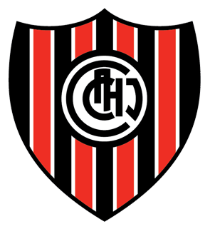
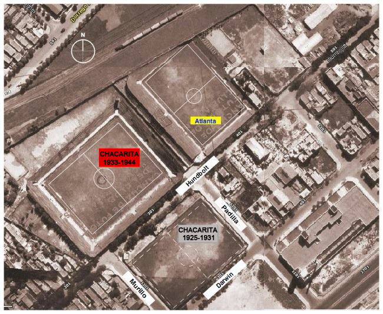
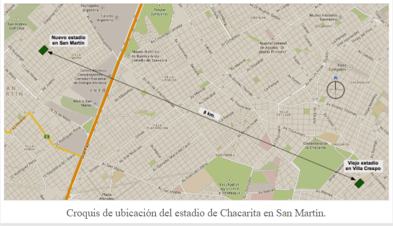
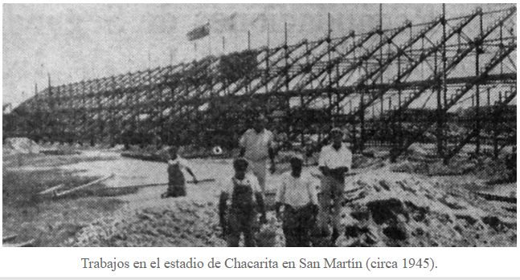
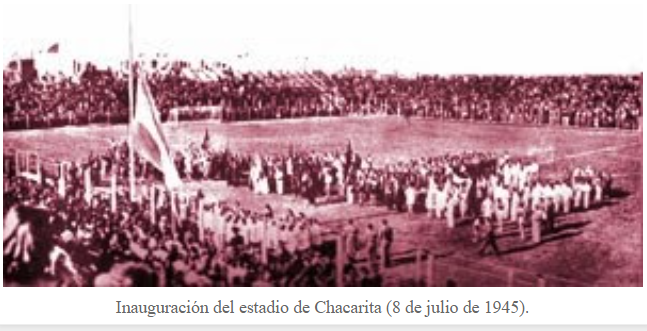
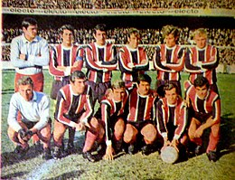
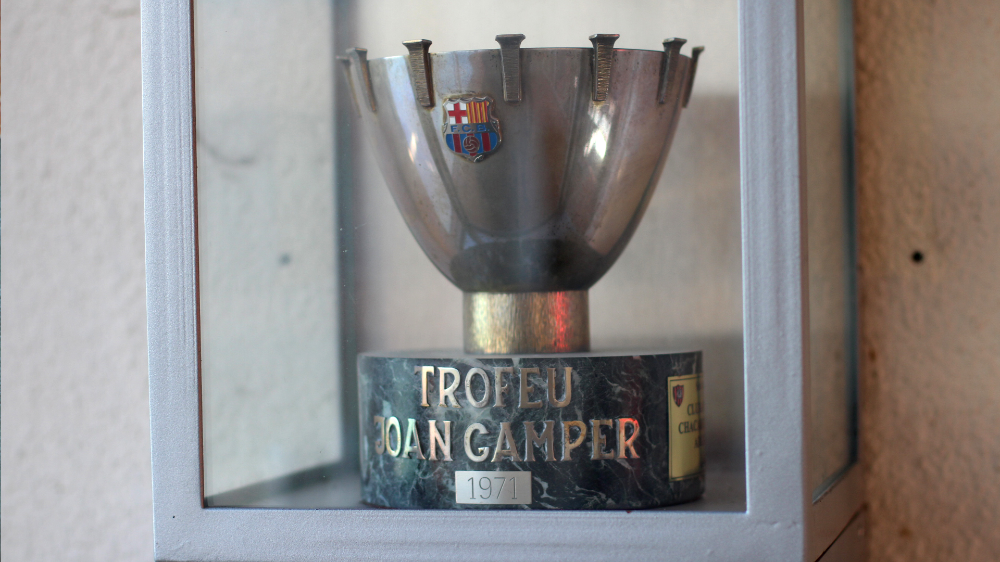

# CACHJ
<HTML>	
	<HEAD>
		<title> CACHJ </title>	
        <link rel="stylesheet" type= "text/css" href="head.css">
	</HEAD>	
	
	<BODY>

		<h1>Club Atletico Chacarita Juniors </h1>

        

            El Club Atlético Chacarita Juniors es un club deportivo de la ciudad de Buenos Aires, Argentina. Su sede social se encuentra en el barrio de Chacarita. Su estadio está ubicado en Villa Maipú, partido de General San Martín, en la Provincia de Buenos Aires. Fue fundado el 1 de mayo de 1906 y su principal actividad es el fútbol profesional. Actualmente milita en la Primera Nacional, la segunda división del fútbol argentino.
        

        

            
        

         

        <h1>Estadio</h1>

        

            Por ese entonces, era muy difícil conseguir un terreno para instalar un campo de juego. La necesidad de tener un predio era grande. Entre las avenidas Federico Lacroze y Álvarez Thomas existía un terreno baldío que la comisión directiva comenzó a tener en cuenta con mayor interés. En abril de 1907, los muchachos alambraron el predio y construyeron una casilla humilde, quedando registrada así la primera cancha del club de la historia. Lamentablemente, esos terrenos serían utilizados por la municipalidad para construir una calle. Por eso una mañana, una camioneta de la Policía llegó al lugar y desarmó las instalaciones. Por apenas días Chacarita Juniors tuvo su primer estadio en Lacroze y Álvarez Thomas.
             
            En 1925, en la manzana de Humboldt, Murillo, Padilla y Darwin se comenzó la primera cancha oficial de Chacarita de su historia. Las obras demandaron dos años y fueron los propios jugadores, junto con dirigentes y simpatizantes del club, los que colaboraron con la construcción del estadio ya que la economía del club era por demás escasa. La misma se inauguró en 1927. Con el paso del tiempo Chacarita se afianzaba más en primera, y el estadio iba quedando chico. Por eso los dirigentes coincidieron en conseguir una cancha con mayor capacidad. Esa cancha llegó. En Humboldt al 300, entre Murillo, Padilla y las vías del ferrocarril, Chacarita tuvo su segunda cancha, que tenía una capacidad para 25 mil personas. La misma se inauguró en 1932, con más de 18 mil personas presentes, en una fiesta que concluyó con amistoso ante Nacional de Uruguay, que el local ganó por 3 a 0.
             
            Ya consolidado en primera, después de un campeonato aceptable en 1942, luego de ascender, Chacarita se tuvo que ir del barrio de Villa Crespo y se mudó a San Martín. El inconveniente fue el siguiente: los terrenos en donde se encontraba la cancha eran rentados, junto con los terrenos del rival de siempre, el Club Atlético Atlanta. En 1943, a finales de ese año, Chacarita estaba atrasado un tiempo con el pago mensual del alquiler. Al enterarse de esto, la comisión directiva de Atlanta junto a varios socios, le ofrecieron al dueño comprar esos terrenos para quedarse con ambos predios, y después de varios juicios e idas y vueltas Chacarita finalmente fue desalojado, por eso hoy en día ahí se encuentra el estadio Don León Kolbowsky, y en el lugar donde estaba el de Atlanta construyeron finalmente la sede del club bohemio para desarrollar sus actividades sociales, culturales y el resto de las deportivas. El último encuentro jugado en ese estadio fue el 16 de diciembre de 1944 entre Colegiales y Temperley. De esta manera, el club comenzó la construcción de su estadio en San Martín, donde consiguió un terreno destinado a tal fin.
        

        

         
        
        <h1>Nuevo estadio</h1>

        

            El 8 de julio de 1945, luego de 141 días de ardua labor, quedó inaugurado el estadio del club en San Martín con una gran fiesta a la que asistieron más de 20 mil personas y que finalizó con un amistoso entre los de casa y nuevamente Nacional, que ganó el local por 1 a 0. Era un estadio con tablones y una platea lateral de cemento, el que fue utilizado durante 60 años.
        

         

        

            
            
            
        

        <h1>Hechos relevantes</h1>

       <table class="tabla"> 
           <tr>   
               <td></td>
               <td></td>
           </tr>
           <tr>
               <td><h2>Campeón Metropolitano de 1era división</h2></td>
               <td><h2>Trofeo Joan Gamper</h2></td>
           </tr>
           <tr>
               <td>
En 1969 Federico Pizarro reemplazó a Argentino Geronazzo manteniendo la base del equipo. En el Campeonato Metropolitano de 1969 Chacarita presentó una formación clásica (4-3-3) con los titulares Petrocelli, Gómez, Pérez, Bargas y Frassoldati, Recúpero, Puntorero y Poncio; Ángel Alberto Marcos (capitán), Orife y Neumann. También jugaron Palacios, Alfredo Gualterio Ortíz, Juan Domingo Loyola, Voglino, García Cambón, Zacarías Zurita y Oscar Amarilla.​   ganó la zona A del torneo y tras vencer en semifinales a Racing Club por 1 a 0, se consagró campeón de la primera división el 6 de julio tras ganarle la final al Club Atlético River Plate en el estadio de Racing por 4 a 1.
</td>
               <td>
En 1971 Chacarita fue uno de los tres equipos invitados por el FC Barcelona para disputar el Trofeo Joan Gamper, junto con el Bayern Munich, de Alemania, y el Honved, de Hungría. El conjunto argentino se había consagrado campeón en el Metropolitano de 1969 al vencer por 4 a 1 en la final a River Plate y se había ganado el boleto a disputar el certamen amistoso.   El 24 de agosto saltó al Camp Nou para medirse frente al conjunto alemán conformado por jugadores como Franz Beckenbauer, Gerd Müller y Sepp Maier, quienes luego serían parte fundamental de plantel de Alemania campeón del Mundial de 1974. Para sorpresa de todos, el "Funebrero" ganó 2 a 0.
</td>
           </tr>
       </table>    
    
       

    <h1>Cuestionario</h1>
    <form action="mailto:totobelpu10@gmail.com">

      

    

    <h4>Ingresa tu nombre: <input type = "text" name="Nombre"></h4>

    <h3>En que año se fundó el Club Atletico Chacarita Juniors</h3>
    <input type="radio" name="añofundacion" class="" value="1906">
    <label for="476dc">1906</label>
     
    <input type="radio" name="añofundacion" class="" value="1916">
    <label for="476ac">1916</label>
     
    <input type="radio" name="añofundacion" class="" value="1908">
    <label for="492dc">1908</label>
     

    <h3>Cual es el clasico rival del club</h3>
    <input type="radio" name="clasicorival" class="" value="Boca">
    <label for="Boca">Boca</label>
     
    <input type="radio" name="clasicorival" class="" value="River">
    <label for="River">River</label>
     
    <input type="radio" name="clasicorival" class="" value="Atlanta">
    <label for="Atlanta">Atlanta</label>
     

    <h3>Rival en su unica final disputada del trofeo Joan Gamper, en Barcelona</h3>
    <input type="radio" name="finaljoan" class="" value="Barcelona">
    <label for="Barcelona">Barcelona</label>
     
    <input type="radio" name="finaljoan" class="" value="Bayern Leverkusen">
    <label for="Bayern Leverkusen">Bayern Leverkusen</label>
     
    <input type="radio" name="finaljoan" class="" value="Bayern Munich">
    <label for="Bayern Munich">Bayern Munich</label>
      

    <input type="submit" value="Enviar">

    

     

    </form>
    </BODY>
</HTML>
